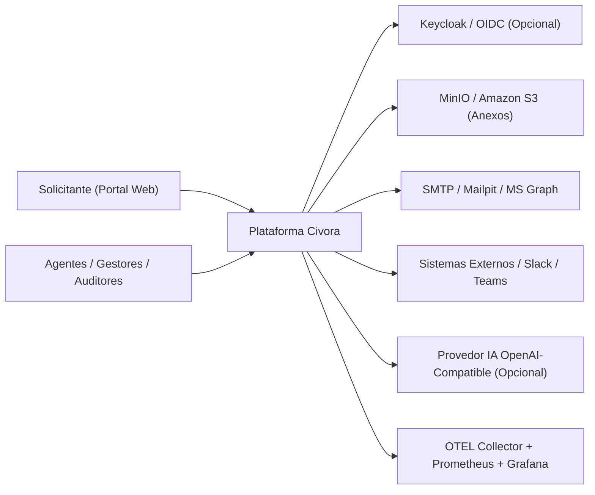
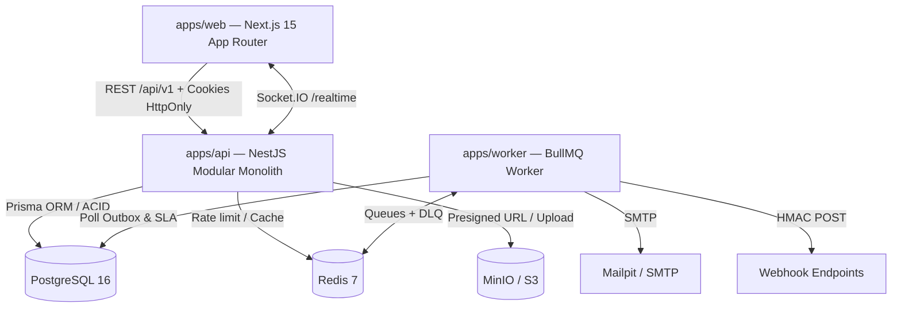
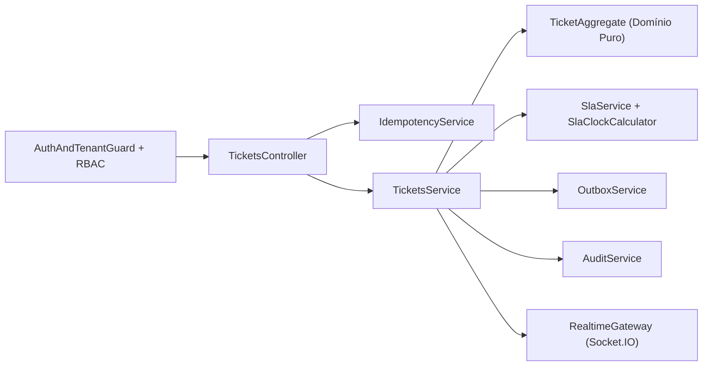

# Diagramas C4 — Arquitetura Civora

## Nível 1: Contexto do Sistema

```mermaid
flowchart LR
  Req["Solicitante (Portal Web)"] --> Civora["Plataforma Civora"]
  Agent["Agentes / Gestores / Auditores"] --> Civora
  Civora --> IdP["Keycloak / OIDC (Opcional)"]
  Civora --> Storage["MinIO / Amazon S3 (Anexos)"]
  Civora --> Email["SMTP / Mailpit / MS Graph"]
  Civora --> Webhooks["Sistemas Externos / Slack / Teams"]
  Civora --> LLM["Provedor IA OpenAI-Compatible (Opcional)"]
  Civora --> Obs["OTEL Collector + Prometheus + Grafana"]
```

## Nível 2: Containers

```mermaid
flowchart TB
  Web["apps/web — Next.js 15 App Router"] -->|REST /api/v1 + Cookies HttpOnly| Api["apps/api — NestJS Modular Monolith"]
  Web <-->|Socket.IO /realtime| Api
  Api -->|Prisma ORM / ACID| Pg[("PostgreSQL 16")]
  Api -->|Rate limit / Cache| Redis[("Redis 7")]
  Api -->|Presigned URL / Upload| Minio[("MinIO / S3")]
  Worker["apps/worker — BullMQ Worker"] -->|Poll Outbox & SLA| Pg
  Worker <-->|Queues + DLQ| Redis
  Worker -->|SMTP| Mailpit["Mailpit / SMTP"]
  Worker -->|HMAC POST| Ext["Webhook Endpoints"]
```

## Nível 3: Componentes do Modular Monolith (`apps/api`)

```mermaid
flowchart LR
  Guard["AuthAndTenantGuard + RBAC"] --> TicketsCtrl["TicketsController"]
  TicketsCtrl --> Idemp["IdempotencyService"]
  TicketsCtrl --> TicketsSvc["TicketsService"]
  TicketsSvc --> TicketAgg["TicketAggregate (Domínio Puro)"]
  TicketsSvc --> SlaSvc["SlaService + SlaClockCalculator"]
  TicketsSvc --> OutboxSvc["OutboxService"]
  TicketsSvc --> AuditSvc["AuditService"]
  TicketsSvc --> RealtimeGw["RealtimeGateway (Socket.IO)"]
```

